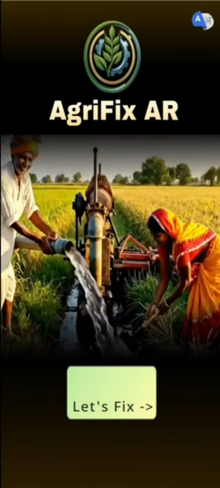

````markdown
# AgriFix AI — Intelligent Agricultural Machinery Repair Assistant


AgriFix AI is an intelligent multimodal repair assistant designed to help farmers diagnose and fix agricultural machinery using voice, video, and images. The system combines computer vision, speech recognition, and Retrieval-Augmented Generation (RAG) to convert static repair manuals into an interactive troubleshooting system.



---

# Table of Contents

- [About the Project](#about-the-project)
- [Key Features](#key-features)
- [Tech Stack & Architecture](#tech-stack--architecture)
- [Getting Started](#getting-started-local-installation)
- [Usage](#usage--api-documentation)
- [Folder Structure](#folder-structure)
- [Roadmap](#roadmap)
- [Contributing](#contributing--license)

---

# About the Project

Agricultural machinery breakdowns often occur in rural environments where technical support is difficult to access. Farmers frequently rely on complex service manuals or must wait for mechanics, resulting in lost productivity and downtime.

AgriFix AI addresses this challenge by transforming traditional repair documentation into an interactive AI system capable of diagnosing issues using real-world inputs such as voice recordings and machine videos.

The platform integrates computer vision models, speech recognition, vector search, and large language models to guide users through machine troubleshooting and repair procedures.

Instead of manually searching through hundreds of pages of manuals, a user can simply describe the issue or record a short video of the machine. The system then retrieves relevant instructions from the knowledge base and generates step-by-step repair guidance.

---

# Key Features

### Multimodal Machine Diagnosis

Users can describe problems using text, voice, or video. The system processes these inputs to determine the machine type and likely mechanical issue.

### Retrieval-Augmented Repair Knowledge

Technical manuals are ingested into a vector database and indexed using embeddings. Relevant repair instructions are retrieved using semantic search.

### Voice-to-Text Processing

Voice inputs are automatically transcribed using speech recognition models, allowing farmers to describe problems naturally.

### Computer Vision Machine Detection

Video frames are analyzed using vision models to detect machine categories such as tractors, pumps, and threshers.

### AI-Generated Repair Instructions

Large language models synthesize information from manuals and user inputs to generate step-by-step troubleshooting guidance.

### Visual Repair Verification

After performing a repair step, users can upload a photo to verify whether the repair was completed correctly.

### Security and Rate Limiting

The backend includes protection layers such as:

- Request rate limiting
- Gemini API usage guardrails
- File upload validation
- Prompt injection detection
- API key protection

### AI Cost Optimization

The system includes semantic response caching to reduce LLM usage and API costs while maintaining fast response times.

---

# Tech Stack & Architecture

## Frontend

**Flutter**

Flutter is used to build the mobile user interface that allows farmers to:

- Capture videos of machinery
- Record voice descriptions
- Upload repair images
- View step-by-step AI guidance

Flutter was selected for its cross-platform capabilities and strong mobile performance.

---

## Backend

**Python FastAPI**

FastAPI powers the backend API responsible for:

- media upload handling
- AI pipeline orchestration
- RAG retrieval operations
- security enforcement

FastAPI was chosen for its asynchronous architecture and high performance when handling media processing workloads.

---

## AI / Machine Learning

### Gemini

Used for reasoning and generating repair instructions based on retrieved knowledge.

### MobileCLIP

Used for lightweight machine detection from video frames.

### Whisper

Used for converting farmer voice recordings into text for analysis.

### Retrieval-Augmented Generation (RAG)

The system retrieves relevant manual sections from a vector database before generating responses.

---

## Database

**ChromaDB**

Stores vector embeddings generated from machine repair manuals. These embeddings enable semantic search across documentation.

---

## Security Layer

The backend includes multiple security protections:

- Per-IP rate limiting
- Gemini usage quotas
- File type and duration validation
- API key verification
- Prompt injection filtering

These mechanisms protect the system from misuse and prevent uncontrolled API cost consumption.

---

# Getting Started (Local Installation)

## Prerequisites

The following tools must be installed before running the project:

- Python 3.10+
- Flutter SDK
- Git
- Google AI Studio API Key (Gemini)

---

## Clone the Repository

```bash
git clone https://github.com/YOUR_USERNAME/AgriFix.git
cd AgriFix
````

---

## Backend Installation

Create a Python virtual environment.

```bash
python -m venv venv
```

Activate the environment.

Windows

```bash
venv\Scripts\activate
```

Linux / macOS

```bash
source venv/bin/activate
```

Install backend dependencies.

```bash
pip install -r requirements.txt
```

---

## Environment Variables

Create a `.env` file in the backend directory.

| Variable               | Description                         |
| ---------------------- | ----------------------------------- |
| GEMINI_API_KEY         | API key for Google Gemini           |
| VIDEO_MAX_MB           | Maximum allowed video upload size   |
| AUDIO_MAX_MB           | Maximum allowed audio upload size   |
| VIDEO_MAX_SECONDS      | Maximum video duration              |
| AUDIO_MAX_SECONDS      | Maximum audio duration              |
| GEMINI_TIMEOUT_SECONDS | Timeout limit for Gemini API calls  |
| GEMINI_HOURLY_LIMIT    | Maximum Gemini calls allowed per IP |
| APP_SECRET_KEY         | Server authentication key           |

Example `.env` file:

```env
GEMINI_API_KEY=[Insert API Key Here]
VIDEO_MAX_MB=20
AUDIO_MAX_MB=5
VIDEO_MAX_SECONDS=20
AUDIO_MAX_SECONDS=20
GEMINI_TIMEOUT_SECONDS=60
GEMINI_HOURLY_LIMIT=10
APP_SECRET_KEY=[Insert Generated Secret]
```

---

## Running the Backend

Start the FastAPI server.

```bash
uvicorn main:app --host 0.0.0.0 --port 7680 --reload
```

API documentation will be available at:

```
http://localhost:7680/docs
```

---

## Running the Flutter App

Navigate to the Flutter application directory.

```bash
cd agrifix_app
flutter pub get
flutter run
```

---

# Usage / API Documentation

## Diagnose Machine Issue

Endpoint:

```
POST /diagnose/stream
```

Example request:

User uploads:

* machine video
* voice description

Example response:

```json
{
  "machine": "tractor",
  "diagnosis": "Starter motor failure likely",
  "steps": [
    "Check battery voltage",
    "Inspect starter motor wiring",
    "Replace faulty starter solenoid"
  ]
}
```

---

## Verify Repair Step

Endpoint:

```
POST /verify_step
```

Example request:

```
image: uploaded repair photo
step_description: "Reconnect the battery terminal"
```

Example response:

```json
{
  "status": "pass",
  "confidence": 0.92,
  "feedback": "Battery terminal appears correctly attached."
}
```

---

# Folder Structure

```
AgriFix_Workspace
│
├── agrifix_app
│   ├── lib
│   ├── android
│   └── pubspec.yaml
│
├── AgriFixAR_Python_Client
│   ├── agent
│   │   ├── repair_agent.py
│   │   ├── session_manager.py
│   │   └── safety_rules.py
│   │
│   ├── services
│   │   ├── diagnosis_service.py
│   │   ├── machine_detection_service.py
│   │   ├── transcription_service.py
│   │   └── verification_service.py
│   │
│   ├── utils
│   │   ├── helpers.py
│   │   └── machine_registry.py
│   │
│   ├── security.py
│   ├── main.py
│   └── requirements.txt
│
├── Demo_Images
└── README.md
```

---

# Roadmap

Planned improvements include:

* Augmented Reality repair guidance using Unity
* Offline AI inference for rural environments
* Support for additional machine categories
* Predictive maintenance using sensor data
* Improved multilingual support for regional languages

---

# Contributing & License

Contributions are welcome.

1. Fork the repository
2. Create a feature branch

```bash
git checkout -b feature/new-feature
```

3. Commit your changes

```bash
git commit -m "Add new feature"
```

4. Push the branch

```bash
git push origin feature/new-feature
```

5. Open a Pull Request

---

# License

This project is distributed under the MIT License.

```

---
