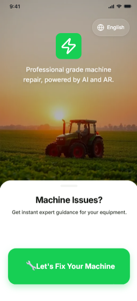
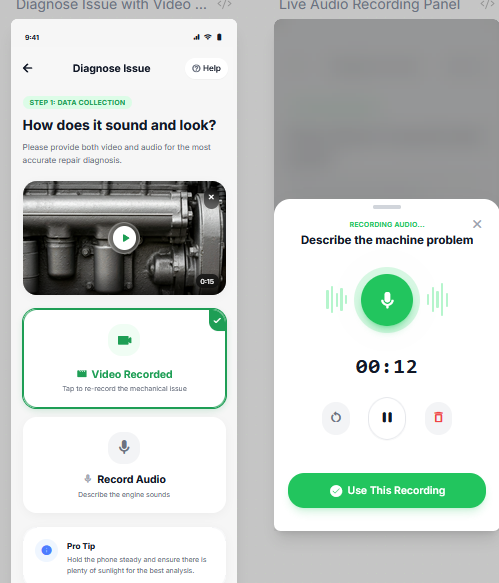
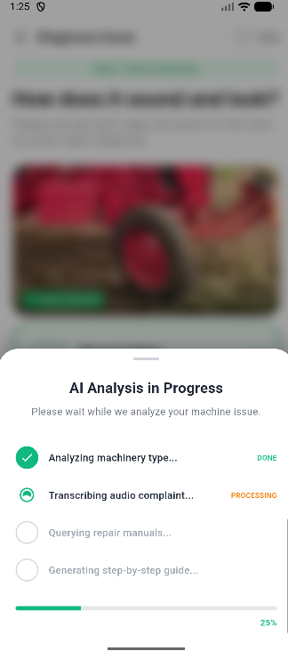

# AgriFix AI


AgriFix AI is a multimodal agricultural repair assistant that helps farmers diagnose and fix machinery using voice, video, and images. The system integrates computer vision, speech recognition, retrieval-augmented generation, and large language models to transform static repair manuals into an interactive troubleshooting system.

The platform enables users to describe machine problems in natural language, record short videos of malfunctioning equipment, and receive AI-generated step-by-step repair guidance based on real technical documentation.

| Home Dashboard | Recording & Upload | AI Analysis |
| :---: | :---: | :---: |
|  |  |  |
---

# Table of Contents

- About the Project
- System Overview
- Key Features
- Architecture
- AI Pipeline
- Tech Stack
- Getting Started
- API Documentation
- Performance Benchmarks
- Folder Structure
- Security
- Roadmap
- Contributing
- License

---

# About the Project

Agricultural equipment failures frequently occur in rural environments where access to skilled technicians is limited. Farmers often rely on large technical manuals or must wait for external support, which results in equipment downtime and financial loss.

AgriFix AI addresses this problem by converting repair manuals into an intelligent assistant capable of diagnosing issues through real-world inputs such as voice recordings, images, and machine videos.

Instead of manually navigating through hundreds of pages of documentation, users can simply describe the issue or capture a short video of the machine. The system then retrieves relevant sections from its knowledge base and generates clear troubleshooting instructions.

---

# System Overview

AgriFix AI integrates multiple AI subsystems to process multimodal inputs and produce actionable repair guidance.

```

User Input
│
├── Video Recording
├── Voice Description
└── Text Input
│
▼
Media Processing Layer
│
├── Speech-to-Text
├── Frame Extraction
└── File Validation
│
▼
Machine Detection
(MobileCLIP)
│
▼
Knowledge Retrieval
(ChromaDB Vector Search)
│
▼
Reasoning Layer
(Gemini LLM)
│
▼
Step-by-Step Repair Guidance

```

---

# Key Features

## Multimodal Machine Diagnosis

Users can submit:

- video recordings
- voice descriptions
- text explanations

The system processes these inputs to determine the machine category and likely mechanical issue.

---

## Retrieval-Augmented Knowledge System

AgriFix AI uses Retrieval-Augmented Generation to ground AI responses in technical manuals.

Manuals are:

- parsed from PDFs
- chunked into semantic sections
- embedded into vectors
- stored in ChromaDB

Relevant sections are retrieved during diagnosis.

---

## Computer Vision Machine Detection

Video frames are analyzed using MobileCLIP to classify machinery types such as:

- tractors
- irrigation pumps
- threshers
- motors
- tillers

This improves the accuracy of the diagnosis pipeline.

---

## Voice-First User Interaction

Speech recordings are automatically transcribed and analyzed, allowing farmers to explain problems naturally.

Example:

```

"My tractor is not starting and making a clicking sound."

```

The system converts this input into structured diagnostic queries.

---

## AI-Generated Repair Instructions

The LLM synthesizes:

- user description
- detected machine type
- relevant manual sections

to produce step-by-step repair instructions.

---

## Visual Repair Verification

Users can upload an image after completing a repair step.

The system verifies whether the repair was performed correctly.

Example output:

```

Repair Step: Tighten the oil filter

Result: Correct installation detected
Confidence: 0.94

```

---

# Architecture

AgriFix AI follows a modular architecture separating client interfaces, backend orchestration, and AI processing.

```

Flutter Mobile App
│
▼
FastAPI Backend
│
├── Media Processing
├── Security Layer
├── AI Orchestration
│
▼
AI Services
│
├── Whisper (Speech Recognition)
├── MobileCLIP (Machine Detection)
├── ChromaDB (Vector Retrieval)
└── Gemini (Reasoning)

```

---

# AI Pipeline

The diagnosis pipeline combines multiple AI components.

```

Voice Input
│
▼
Speech Recognition
│
▼
Machine Detection
(Video Frames)
│
▼
Semantic Retrieval
│
▼
LLM Reasoning
│
▼
Repair Instructions

```

---

# Tech Stack

## Frontend

Flutter

Used for building the mobile interface that allows users to:

- record videos
- capture images
- submit voice descriptions
- view repair guidance

---

## Backend

FastAPI

Responsible for:

- media uploads
- AI orchestration
- request validation
- API management

FastAPI was selected for its asynchronous architecture and performance.

---

## AI Models

### Gemini

Used for reasoning and repair instruction generation.

---

### Whisper

Used for converting voice recordings into text.

---

### MobileCLIP

Used for machine classification from video frames.

---

### Retrieval System

ChromaDB

Stores vector embeddings generated from repair manuals.

---

# Getting Started

## Prerequisites

Install the following tools before running the project.

- Python 3.10+
- Flutter SDK
- Git
- Google AI Studio API Key

---

## Clone Repository

```

git clone [https://github.com/YOUR_USERNAME/AgriFix.git](https://github.com/YOUR_USERNAME/AgriFix.git)
cd AgriFix

```

---

## Backend Setup

Create virtual environment.

```

python -m venv venv

```

Activate environment.

Windows:

```

venv\Scripts\activate

```

Linux / macOS:

```

source venv/bin/activate

```

Install dependencies.

```

pip install -r requirements.txt

```

---

## Environment Variables

Create `.env` file.

| Variable | Description |
|--------|-------------|
| GEMINI_API_KEY | Gemini API key |
| VIDEO_MAX_MB | Maximum video upload size |
| AUDIO_MAX_MB | Maximum audio upload size |
| VIDEO_MAX_SECONDS | Maximum allowed video duration |
| AUDIO_MAX_SECONDS | Maximum audio duration |
| GEMINI_TIMEOUT_SECONDS | Timeout for LLM requests |
| GEMINI_HOURLY_LIMIT | Max Gemini calls per IP |
| APP_SECRET_KEY | Server authentication key |

Example:

```

GEMINI_API_KEY=[Insert API Key]
VIDEO_MAX_MB=20
AUDIO_MAX_MB=5
VIDEO_MAX_SECONDS=20
AUDIO_MAX_SECONDS=20
GEMINI_TIMEOUT_SECONDS=60
GEMINI_HOURLY_LIMIT=10
APP_SECRET_KEY=[Insert Secret Key]

```

---

## Run Backend

```

uvicorn main:app --host 0.0.0.0 --port 7680 --reload

```

API documentation:

```

[http://localhost:7680/docs](http://localhost:7680/docs)

```

---

## Run Flutter App

```

cd agrifix_app
flutter pub get
flutter run

```

---

# API Documentation

## Diagnose Machine Issue

```

POST /diagnose/stream

```

Example response:

```

{
"machine": "tractor",
"diagnosis": "Starter motor failure likely",
"steps": [
"Check battery voltage",
"Inspect starter wiring",
"Replace faulty starter solenoid"
]
}

```

---

## Verify Repair Step

```

POST /verify_step

```

Example response:

```

{
"status": "pass",
"confidence": 0.92,
"feedback": "Battery terminal appears properly attached."
}

```

---

# Performance Benchmarks

Typical processing latency.

| Pipeline Stage | Avg Time |
|----------------|---------|
Speech transcription | 6–10 seconds |
Machine detection | 0.6–1.2 seconds |
Vector retrieval | < 0.1 seconds |
LLM reasoning | 10–20 seconds |

Total response time typically ranges between **15–25 seconds** depending on network conditions and input size.

---

# Folder Structure

```AgriFix_Workspace/
│
├── agrifix_app/                          # Flutter application root
│   ├── lib/
│   │   ├── main.dart
│   │   │
│   │   ├── core/
│   │   │   ├── theme.dart                # AppColors, AppTextStyles, AppSpacing, AppShadows
│   │   │   └── router.dart               # GoRouter config, AppRoutes constants
│   │   │
│   │   ├── l10n/
│   │   │   └── app_localizations.dart    # EN/HI string keys for all screens
│   │   │
│   │   ├── services/
│   │   │   ├── api_service.dart          # HTTP + SSE streaming (/diagnose, /verify_step)
│   │   │   └── diagnosis_service.dart    # Diagnosis response parsing helpers
│   │   │
│   │   ├── core/providers/
│   │   │   └── diagnosis_provider.dart   # Holds DiagnosisResult, step index, solution state
│   │   │
│   │   └── screens/
│   │       │
│   │       ├── home/
│   │       │   └── home_screen.dart      # Landing screen — scan CTA, branding card
│   │       │
│   │       ├── upload/
│   │       │   ├── upload_screen.dart    # Video + audio picker, live recorder panels,
│   │       │   └── widgets/
│   │       │       └── analysis_bottom_sheet.dart    # 4-stage progress sheet
│   │       │
│   │       ├── solution/
│   │       │   └── solution_screen.dart    # Step-by-step repair guide, machine info cards
│   │       │
│   │       └── ar_guide/
│   │           └── ar_guide_screen.dart    # Live camera AR overlay, step verification,
│   │
│   ├── android/
│   │   └── app/
│   │       └── src/main/
│   │           ├── AndroidManifest.xml
│   │           └── res/
│   ├── assets/
│   │   ├── images/
│   │   └── icons/
│   │
│   └── pubspec.yaml
├── AgriFixAR_Python_Client
│   ├── agent
│   │   ├── repair_agent.py
│   │   └── session_manager.py
│   │
│   ├── services
│   │   ├── diagnosis_service.py
│   │   ├── machine_detection_service.py
│   │   ├── transcription_service.py
│   │   └── verification_service.py
│   │
│   ├── utils
│   │   └── helpers.py
│   │
│   ├── security.py
│   ├── main.py
│   └── requirements.txt
│
├── Demo_Images
│
└── README.md

```

---

# Security

The backend includes protection mechanisms designed to prevent misuse.

Security measures include:

- per-IP rate limiting
- Gemini API usage limits
- upload file validation
- prompt injection filtering
- API key authentication

These mechanisms protect the system from abuse and uncontrolled API cost usage.

---

# Roadmap

Future improvements include:

- Augmented reality repair guidance using Unity
- Offline AI inference for rural environments
- Predictive maintenance features
- Expanded machine support
- Multi-language repair guidance

---

# Contributing

1. Fork the repository
2. Create a feature branch

```

git checkout -b feature/new-feature

```

3. Commit changes

```

git commit -m "Add feature"

```

4. Push branch

```

git push origin feature/new-feature

```

5. Open a pull request

---

## License

This project is licensed under the MIT License.  
See the [LICENSE](LICENSE) file for details.
```
