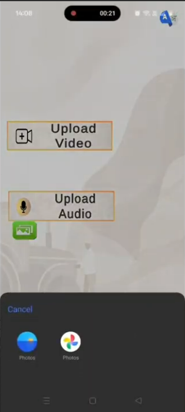
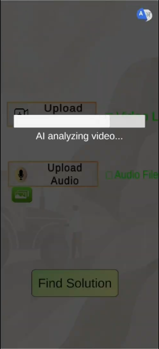
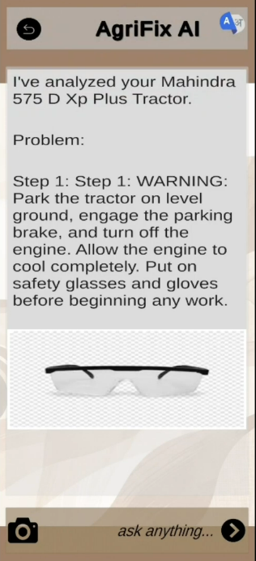

# AgriFix AI: Intelligent Agricultural Repair Assistant 🚜🤖

Empowering farmers with AI-driven diagnostics and real-time repair verification.

AgriFix AI is a robust, multimodal backend system designed to democratize technical support for agricultural machinery. By combining Retrieval-Augmented Generation (RAG) with computer vision, it transforms static technical manuals into an interactive troubleshooting assistant that can diagnose issues via voice, text, or video and visually verify completed repair steps in real time.

---

## Table of Contents

- [Demo](#demo)
- [Key Features](#key-features)
- [Tech Stack](#tech-stack)
- [System Architecture](#system-architecture)
- [Installation & Setup](#installation--setup)
  - [Clone & Environment](#clone--environment)
  - [Local Installation (No Docker)](#local-installation-no-docker)
  - [Build Knowledge Base](#build-knowledge-base)
- [How to Run](#how-to-run)
  - [Option A: Docker](#option-a-using-docker-recommended)
  - [Option B: Local](#option-b-local-execution)
- [Usage Guide](#usage-guide)
  - [Diagnose an Issue](#1-diagnose-an-issue)
  - [Verify a Repair Step](#2-verify-a-repair-step)
- [Project Folder Structure](#project-folder-structure)
- [Configuration Details](#configuration-details)
- [Performance & Optimization](#performance--optimization)
- [Known Limitations](#known-limitations)
- [Roadmap](#roadmap)
- [Contribution Guidelines](#contribution-guidelines)
- [License](#license)
- [Author](#author)

---

## Demo

> [](https://drive.google.com/file/d/1d7G0g6LWDQnx2_7jCyogZK3x_DQ-_Exu/view?usp=sharing)

### Screenshots






Examples:
- High-level overview of the multimodal ingestion and inference pipeline.
- Visual verification of a completed repair step (e.g., correctly installed oil filter).

---

## Key Features

- **RAG-Powered Diagnostics**  
  Retrieves precise repair instructions from large libraries of technical manuals using semantic search over vector embeddings.

- **Multimodal Interaction**  
  Supports input via text, voice (speech-to-text), and video so farmers can describe problems naturally in the format that suits them.

- **Visual Repair Verification**  
  Vision models analyze photos of completed repairs to check whether a step was executed correctly (for example, “Is the oil filter installed securely?”).

- **Automated Knowledge Ingestion**  
  Ingestion pipeline parses PDFs, extracts figures and diagrams, and builds a structured vector database with minimal manual effort.

- **Intelligent Metadata Extraction**  
  Automatically discovers machine brands, models, and error codes during ingestion to organize and filter results effectively.

- **Contextual Assistance**  
  When steps are complex or ambiguous, the system can surface relevant YouTube search links to high-quality explainer videos.

---

## Tech Stack

**Core Backend**

- Framework: FastAPI (Python)  
- ASGI Server: Uvicorn  
- Orchestration: Docker & Docker Compose  

**AI & Machine Learning**

- LLM & Vision: Google Gemini 1.5 Flash / Pro  
- Embeddings: Google Generative AI embeddings (`models/text-embedding-004`)  
- Vector Store: ChromaDB  
- Orchestration: LangChain  
- Audio Processing: OpenAI Whisper  
- Computer Vision: Ultralytics YOLO (object detection), OpenCV  

**Data Processing**

- PDF Parsing: PyMuPDF (`fitz`), PyPDF  
- Image Processing: Pillow (`PIL`)  

---

## System Architecture

AgriFix AI is organized into a decoupled, microservices-ready architecture that separates ingestion, inference, and API exposure.

### Ingestion Service (`build_knowledge.py`)

- Parses raw PDF manuals placed in the `knowledge_base/` directory.  
- Splits text into semantic chunks and extracts relevant images.  
- Generates embeddings using Google models and stores them in ChromaDB.  
- Attaches metadata such as brand, model, and error codes for targeted retrieval.

### API Gateway (`main.py`)

- Exposes REST endpoints for the client (web / mobile / kiosk).  
- Handles file uploads (images, audio, video) and standard JSON requests.  

### Inference Engine

- **Diagnosis Workflow**  
  - Converts audio to text using Whisper.  
  - Queries the vector store for relevant manual sections.  
  - Synthesizes a natural-language diagnosis and step-by-step plan using Gemini.  

- **Verification Workflow**  
  - Accepts a “current state” image and a textual description of the target step.  
  - Uses the vision model to compare expected vs observed state.  
  - Returns a pass/fail decision with confidence and human-readable feedback.

---

## Installation & Setup

### Prerequisites

- Python 3.10+  
- Docker (optional but recommended for deployment)  
- Google AI Studio API key (Gemini)

### Clone & Environment

Clone the repository
```
git clone https://github.com/technospes/agrifix-ai.git
cd agrifix-ai
```
Environment configuration
```
cp .env.example .env # If you have an example file, otherwise create .env manually
```
Update `.env` with your Gemini API key:

GOOGLE_API_KEY=your_gemini_api_key_here


### Local Installation (No Docker)

Create virtual environment
```
python -m venv venv
source venv/bin/activate # On Windows: venv\Scripts\activate
```
Install dependencies
```
pip install -r requirements.txt
```

### Build Knowledge Base

Place your technical manuals (PDFs) into the `knowledge_base/` directory and run:
```
python build_knowledge.py
```

This script ingests the manuals, generates embeddings, and populates `chroma_db/`.

---

## How to Run

### Option A: Using Docker (Recommended)

**Build the container:**

docker build -t agrifix-backend .


**Run the container:**
```
docker run -p 7860:7860 --env-file .env agrifix-backend
```

### Option B: Local Execution

From the project root:
```
uvicorn main:app --host 0.0.0.0 --port 7860 --reload
```

Then open:

- Swagger UI: `http://localhost:7860/docs`  
- Base health check (if implemented): `http://localhost:7860/diagnose`

---

## Usage Guide

### 1. Diagnose an Issue

**Endpoint:** `POST /diagnose`  

Send either an audio file (engine noise, explanation in voice) or a text description.

**Example JSON response:**

{
"diagnosis": "The clicking sound suggests a starter motor failure.",
"steps": [
"Check battery voltage.",
"Inspect starter solenoid connections."
],
"relevant_manual_sections": [
{
"manual": "Tractor_XYZ_Service_Manual.pdf",
"section": "Starter Motor Troubleshooting",
"page": 42
}
]
}


### 2. Verify a Repair Step

**Endpoint:** `POST /verify_step`  

Upload an image of the completed repair and provide the step description.

curl -X POST "http://localhost:7860/verify_step"
-F "image=@battery_photo.jpg"
-F "step_description=Reconnect the negative battery terminal"


**Example JSON response:**

{
"status": "pass",
"feedback": "The negative terminal appears securely fastened and clean.",
"confidence": 0.95
}


---

## Project Folder Structure
```
AgriFix_AI/
├── chroma_db/ # Persistent vector database storage
├── knowledge_base/ # Raw PDF manuals for ingestion
├── temp_uploads/ # Temporary storage for uploaded files
├── build_knowledge.py # Knowledge ingestion pipeline
├── extract_images.py # PDF image extraction utility
├── main.py # FastAPI application entry point
├── test_knowledge_base.py # RAG retrieval testing / evaluation script
├── Dockerfile # Container configuration
├── requirements.txt # Python dependencies
└── README.md # Documentation
```

---

## Configuration Details

Key configuration points (see `main.py` and `build_knowledge.py`):

- `MAX_FILE_SIZE` – Maximum upload size in bytes (default: 100 MB).  
- `CHROMA_DB_PATH` – Path to the vector store (default: `./chroma_db`).  
- `LLM_MODEL` – Defaults to `gemini-1.5-flash` for speed; switch to `gemini-1.5-pro` for more complex reasoning.  
- `EMBEDDING_MODEL` – Uses `models/text-embedding-004`.  

Environment variables are centralized in `.env` for easier deployment and secrets management.

---

## Performance & Optimization

- **Asynchronous I/O**  
  FastAPI endpoints are implemented as async handlers to support concurrent uploads and inference workloads efficiently.

- **Persistent Vector Store**  
  ChromaDB persists embeddings locally so PDFs are ingested once and reused across restarts.

- **Optimized Docker Image**  
  Uses `--no-cache-dir` for `pip` installs and pre-installs tools like `ffmpeg` for audio/video handling while keeping image size reasonable.

---

## Known Limitations

- **PDF Complexity**  
  Highly complex, multi-column, or scanned manuals may yield imperfect text segmentation and require manual cleanup for best results.

- **External API Dependencies**  
  Throughput and latency depend on Google Gemini API quotas and network conditions.

- **Online-Only Inference (Current)**  
  The production pipeline assumes internet connectivity to reach Gemini endpoints; fully offline operation is part of the roadmap.

---

## Roadmap

- [ ] **Offline Mode**: Integrate local LLMs (Llama 3 / Mistral) and local embedding models for fully offline farm deployments.  
- [ ] **AR Overlay**: Mobile or headset-based AR experience to project repair diagrams directly onto the machine.  
- [ ] **Predictive Maintenance**: Use historical logs and sensor data to predict failures and suggest preventive actions.  
- [ ] **Multi-language Support**: On-the-fly translation of manuals and responses for non‑English-speaking farmers.

---

## Contribution Guidelines

Contributions are welcome.

1. Fork the repository.  
2. Create a feature branch:
```
git checkout -b feature/NewFeature
```

3. Commit your changes with a clear message.  
4. Push the branch:
```
git push origin feature/NewFeature
```

5. Open a Pull Request describing the motivation, changes, and any breaking impacts.

---

## License

Distributed under the MIT License. See `LICENSE` for details.

---

## Author

**Technospes**

- GitHub (Technospes): https://github.com/technospes
- LinkedIn (Ayush Shukla): https://www.linkedin.com/in/ayushshukla-ar/
